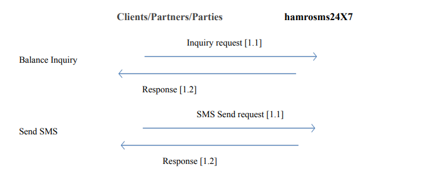

># __API Integration__


# __Developers Guide__ ,
====================


<!-- @import "[TOC]" {cmd="toc" depthFrom=1 depthTo=6 orderedList=false} -->


># __ABSTRACT__

API, an abbreviation of Application Program Interface, is a set of routines, protocols, and
tools for building software applications. The API specifies how software components
should interact. Virtually all software has to request other software to do some things for
it. To accomplish this, the asking program uses a set of standardized requests, called
Application Programming Interface (API). Building an application with no APIs is
basically like building a house with no doors. The API for all computing purposes is how
we open the blinds and the doors and exchange information.
This documentation is about SMS API integration with hamrosms24X7. This document
guides users to integrate SMS api into their system


# __System Integration__



Fig1: System Interaction with partner/Client Server for balance enquiry and sms sending 


The scenario visualized in above figure shows an overall communication from users’s Server to hamrosms24X7 and response back to the user’s Server. Number in bracket specifies the order of process that is carried out between user and hamrosms24X7.


>## __Integration__

Before starting the integration, the party must be a registered user in hamrosms247.com. After registration , the party intending for sms api integration will receive an unique token (note: it is an non – recoverable alphanumeric token which is generated only once. That means, the token once deleted/expired cannot be recovered instead a new token can be generated). With having a unique token , the api integration can be initiated.

>##  1.1  __Balance Inquiry__ 

The client/partner calls the hamrosms24X7 server with a unique token as in process 1.1 of Balance enquiry shown in figure above. If the unique token, response (1.2) is sent back to client/partner/party with the current balance in their account. If the token is invalid,error message is sent from partner/client/party. 

### __Below is the API detail.__
    


## Request:
Request is made with the unique request id or token generated by the client. 

__URL__: [https://hamrosms247.com/api/balance](https://hamrosms247.com/api/balance)
    <br><br>

### __Request Method:__ GET

Request Headers: {Authorization: Bearer {Token received from hamrosms24X7}}

## Response 
```
   { 
        "balance":{balance},
        "rate":{rate}
    }
```


## __Table: response Details__

| Parameter    | Parameter Type     | Description    |
|--------------|--------------------|----------------|
| Balance      | Double             | Current Balance|
| rate         | Double             | Current Rate   |


## Example: 
Request URI: : [: https://hamrosms247.com/api/balance](https://hamrosms247.com/api/balance)


### Request Method: GET
__Request Header__  : {Authorization: Bearer <br>
eyJ0eXAiOiJKV1QiLCJhbGciOiJSUzI1NiIsImp0aSI6ImE2NTQ0MzA5OWI5MDFiOD

} 

__Success Response__ 
```
{
    "balance":2,
    "rate":1.5
}
```
__Failure Response (when Authentication is not sent)__ <br>
{ <br>
    "error": "Unauthenticated" <br>
}<br>

>### 1. __SMS Send__

For sending sms, the user must use the following api: <br><br>

URL: [https://hamrosms247.com/api/sms](https://hamrosms247.com/api/sms) 

__Request Method :__  &nbsp; POST

__Request Headers:__ { <br>
  Authorization: Bearer <br>
 {Token received from hamrosms24X7},<br>
Content-type: multipart/form-data
<br>}

__Request Body in form data:__ 
```
{
    "message": 'Hello test'

    "mobile" : 9841232345

}
```
<br>
<br>

### __Table Response__

| Field Name | Parameter type | Field Description            |
|------------|----------------|------------------------------|
| messgae    | String         | Message to be Sent in the sms|
| mobile     | String         | Mobile number where the sms is to be sent. If multiplemobile numbers are to be sent , then the numbers are to separated by comma.

## __Response:__

Below is the response received for the above request made –

### __Success Response__
```
{
    "message": "SMS Queued"
}
```

|Field Name | parameter Type | Field Description |
|-----------|----------------|-------------------|
| message   |   String       | Message regarding status of the sms sent|

=========================================================
### Example:
>### __I. &nbsp; Single Receiver SMS Send API :__ <br>
 __Request URI :__ &nbsp; [http://hamrosms247.com/api/sms](http://hamrosms247.com/api/sms)


__Request Headers__: { Authorization: Bearer <br>
eyJ0eXAiOiJKV1QiLCJhbGciOiJSUzI1NiIsImp0aSI6ImE2NTQ0MzA5OWI5MDFiOD <br>
Content-type:multipart/form-data }

## __Method type :__ &nbsp; POST <br>

### __Request Body in form data:__ 
```
{ 
message: Hello test
mobile : 9841232345 
} 
```

### __Success Response:__
```
{
“message”:”SMS Queued!” 
}
```
### __Failure Response (when any body parameters are missing)__

### Error

```
{
"mobile": "mobile is required",
"message": "message is required"
}
```
===============================================

>### __II. &nbsp; Multiple Receiver SMS Send API :__ <br>

__Request URI:__  &nbsp;[https://hamrosms247.com/api/sms](https://hamrosms247.com/api/sms)


__Request Headers :__ { Authorization: Bearer <br>
eyJ0eXAiOiJKV1QiLCJhbGciOiJSUzI1NiIsImp0aSI6ImE2NTQ0MzA5OWI5MDFiOD,<br>
Content-type: multipart/form-data }

## __Method type:__ &nbsp; POST <br>

## __Request Body in form data:__ 
```
{
message: Hello test 
mobile : 9841232345, 9801063628 
}
```

### __Success Response:__ 
```

{
“message”:”SMS Queued!” 
} 
```

### __Failure Response (When any body parameters are missing )__

```
“error”:{
“mobile”:”mobile is required”, 
“message”:”message is required” 
}
```
